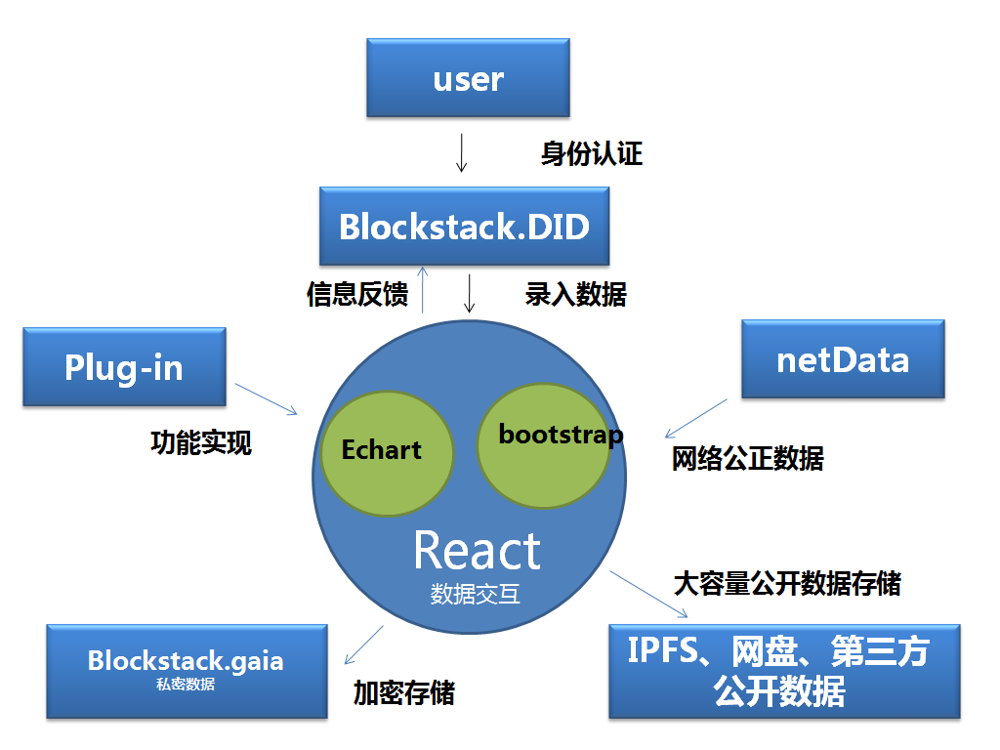
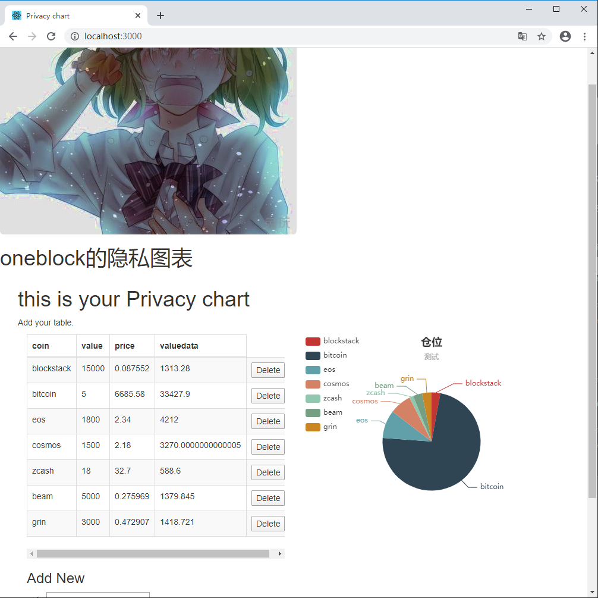

# My Privacy chart v0.1.0

## **愿景**（<font color="red">基本等于吹牛</font>）
* **核心价值**  致力于打造一站式高端私密交互应用，`My garden I'm the Lord`.协同网络海量数据汇聚，自动实现AI与大数据分析，精准研判。打造现代`拉普拉斯妖`。
* **可用场景** :
    * 作为市场交易数据的演示端，与各种交易市场形成绑定，实现可视化交易。身份证认证强加密与数据独立储存绝对保证APIkey安全，可做到一体化跨站式交易与分析，并支持第三方AI插件，轻松实现量化交易。让交易更正自主与便捷
    * 私密财务系统的可视化，统一身份认证，数据成分布式存储，高永久性，无需灾备。可利用插件实现共识化数据统一维护。保证数据唯一性。
    * 数据验证机，利用多重身份认证机制与网络数据定时捕获，做到数据公证与私密验证。
    * 数据分享与销售，利用身份机制实现数据定向权限分享与数据、服务销售
* **数据变现** 实现生产数据演示与销售为一体，插件开发盈利。

## 流程图


## 实例图


## 需求设计
* **数据隐私性保护**
* **分布式的数据统一性,可维护**
* **支持多设备**
* **图表显示自定义**
* **自动获取自定义网络数据**
* **规范API接口，支持第三方插件**
* **有限范围内数据分享与销售**

## 实现方式
* **主体前端框架**：`react`
* **身份证认证与加密**：`blockstack`
* **表格框架**:`bootstrap`
* **图形框架**：`Echart`
* **数据存储**：`blocstack.gaia`、`IPFS`

## 目前进度
 ### var=DEMO

## 使用测试方法

* **安装方法**
```code
    npm install
```
* **测试方法**
```code
    npm start
```
* **构建方法**
```code
    npm run build
```
## 目前具体实现功能
* 启用blockstack身份认证
* 可自动获取coingecko部分虚拟币价格，根据录入仓位信息，进行计算显示
    * 目前支持虚拟币表：
```code
    coins = [
      "bitcoin",
      "eos",
      "cosmos",
      "blockstack",
      "bitcoin-cash",
      "ethereum",
      "ethereum-classic",
      "monero",
      "dash",
      "beam",
      "grin",
      "steem",
      "algorand",
      "zcash",
      "ontology",
      "super-zero"
    ];
```
* 说明录入过程中目前请输入coin全名
  * 比特币请输入`bitcoin`,非**BTC**
* gaia在线保存功能以及加密，数据自由搬迁
* 支持仓位信息图表功能
* 表格底部增加了合计功能`Total` ，同时调试部分CSS  //20200413

## 已知BUG存在
* 点击`saveme`无法自动刷新  `(勉强修复)`
   *  
  ```
  saveMe（）中，修改this.setState( {me,savingMe: true })为this.setState( {savingMe: true })）错误消失  
  // 猜测是me的变量名问题                     20200325
  ```
* 获取coin价格如果没有正常完成，则无法载入 or 录入    `(勉强修复)`
    * 
    ```
    更改this.loadme(),现在加载缓慢了，勉强不会出现无法获取价格不能同步现象 20200325
    ```

## 下一步准备实现功能
* 建立简易API接口
* 其他插件开发

